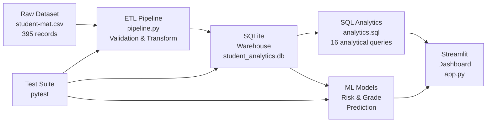

# Student Performance Prediction and Academic Analytics Data Warehouse

A comprehensive end-to-end data analytics system that combines machine learning, ETL pipelines, and interactive dashboards to analyze student academic performance and predict early academic risk. This project demonstrates practical applications of supervised machine learning, data warehousing, and data-driven decision support in an educational context.

## Table of Contents

- [Overview](#overview)
- [Objectives](#objectives)
- [Architecture & Data Flow](#architecture--data-flow)
- [Dataset](#dataset)
- [Data Quality](#data-quality)
- [Warehouse Design](#warehouse-design)
- [ETL Process](#etl-process)
- [SQL Analytics](#sql-analytics)
- [Machine Learning](#machine-learning)
- [Risk Interpretation](#risk-interpretation)
- [Dashboard](#dashboard)
- [Testing](#testing)
- [Project Structure](#project-structure)
- [Installation & Setup](#installation--setup)
- [Technology Stack](#technology-stack)
- [Key Findings](#key-findings)
- [Limitations & Modeling Considerations](#limitations--modeling-considerations)

## Overview

This system enables educational institutions to:

1. **Analyze Historical Performance**: Explore observed academic risk patterns across student demographics and behavioral factors
2. **Predict Final Grades**: Estimate end-of-term mathematics grades based on student information and academic progress indicators
3. **Assess Early Risk**: Identify students at risk of underperformance before grades are finalized, using only early-stage information
4. **Support Decision-Making**: Provide educators with data-driven insights for intervention planning and resource allocation

The project follows a modern data stack approach: raw data → validation → ETL → dimensional warehouse → analytics and machine learning.

## Objectives

- Develop supervised machine learning models for classification (early-risk prediction) and regression (grade prediction)
- Construct a dimensional data warehouse for efficient analytical queries
- Implement comprehensive data validation and quality checks throughout the pipeline
- Create an interactive dashboard for exploratory analytics and prediction
- Demonstrate end-to-end data engineering practices with automated testing

## Architecture & Data Flow



**Pipeline Stages:**

1. **Extract**: Read raw UCI student mathematics dataset
2. **Validate**: Check schema compliance, data ranges, referential integrity, and categorical values
3. **Transform**: Build dimensional tables (schools, students) and fact table (performance metrics)
4. **Load**: Persist to SQLite warehouse with enforced foreign keys
5. **Analyze**: Execute SQL queries for historical analytics
6. **Predict**: Apply machine learning models for risk and grade predictions
7. **Visualize**: Display insights and predictions through interactive dashboard

## Dataset

**Source**: UCI Student Performance Dataset (Mathematics)
- **Records**: 395 students
- **Attributes**: 33 variables
- **Schools**: 2 institutions (Gabriel Pereira, Mousinho da Silveira)
- **Grades**: Numerical scores on a 0–20 scale

**Key Variables**:
- **Academic**: First period grade (G1), second period grade (G2), final grade (G3), absences
- **Demographic**: Age, gender, school, address type (urban/rural), family size
- **Family**: Parent education levels, parent cohabitation, parental jobs, family relationships
- **Behavioral**: Study time, free time, going out frequency, alcohol consumption
- **Support**: School support, family support, extra classes, extracurricular activities
- **Infrastructure**: Internet access, previous failures, travel time, nursery attendance, higher education aspiration

## Data Quality

The ETL pipeline enforces comprehensive validation:

| Check | Details |
|-------|---------|
| **Schema Compliance** | Exact column match with expected source structure |
| **Empty Dataset** | Rejects if source is empty |
| **Duplicates** | Detects and rejects duplicate rows |
| **Numeric Ranges** | Grades must be 0–20; absences must be ≥ 0 |
| **Categorical Values** | Validates allowed values for categorical fields (e.g., school ∈ {GP, MS}) |
| **Null Handling** | Identifies unexpected nulls in required fields |
| **Referential Integrity** | Foreign key constraints enforced at database level |
| **Key Uniqueness** | Student keys and performance keys are unique |
| **Observed Risk Field** | Binary indicator (0 or 1) derived as G3 < 10 |

**Validation Results**: All 395 records pass validation; warehouse quality checks confirm 100% data integrity.

## Warehouse Design

The warehouse follows a **dimensional design pattern** optimized for analytical queries:

### dim_school
| Column | Type | Role |
|--------|------|------|
| school_key | INTEGER PK | Surrogate key |
| school_code | TEXT UNIQUE | GP (Gabriel Pereira), MS (Mousinho da Silveira) |
| school_name | TEXT | Full school name |

### dim_student
| Column | Type | Role |
|--------|------|------|
| student_key | INTEGER PK | Surrogate key |
| student_source_id | INTEGER UNIQUE | Sequential identifier from ETL |
| sex, age, address | — | Demographics |
| famsize, Pstatus | — | Family structure |
| Medu, Fedu, Mjob, Fjob | — | Parental background |
| reason, guardian | — | School choice and guardianship |
| traveltime, studytime, failures | — | Academic behaviors |
| schoolsup, famsup, paid, activities | — | Support and engagement |
| nursery, higher, internet, romantic | — | Background and lifestyle |
| famrel, freetime, goout, Dalc, Walc, health | — | Personal factors |
| school_key | INTEGER FK | Reference to dim_school |

### fact_student_performance
| Column | Type | Role |
|--------|------|------|
| performance_key | INTEGER PK | Surrogate key |
| student_key | INTEGER FK | Reference to dim_student |
| G1 | INTEGER | First period grade (0–20) |
| G2 | INTEGER | Second period grade (0–20) |
| G3 | INTEGER | Final grade (0–20) |
| absences | INTEGER | Total absences |
| observed_at_risk | INTEGER | Binary indicator: 1 if G3 < 10, else 0 |

**Design Rationale**:
- **Dimension tables** store slowly-changing student and school attributes
- **Fact table** captures performance metrics and computed risk indicator
- **Surrogate keys** enable efficient joins and data independence
- **Denormalization** is minimal; queries span three tables for analytics
- **Observed risk** is a derived field, not an ML prediction, enabling historical trend analysis

## ETL Process

**Location**: `etl/pipeline.py`

### Extract

```python
def extract_data():
    """Read the source UCI dataset."""
    df = pd.read_csv(RAW_DATA_PATH, sep=";")
    # Result: 395 rows, 33 columns
```

### Validate

Validates the source dataset before transformation:

```python
def validate_data(df):
    """Validate source schema, data types, ranges, and categorical values."""
    # Schema: Must match exactly 33 expected columns
    # Types: All numeric columns verified as numeric
    # Ranges: Grades 0–20, absences ≥ 0
    # Categoricals: school ∈ {GP, MS}, sex ∈ {F, M}, etc.
    # Duplicates: Must be zero
```

### Transform

Builds dimensional and fact tables:

```python
def transform_data(df):
    """
    Transform into normalized warehouse structure:
    - dim_school: 2 rows (predefined)
    - dim_student: 395 rows (derived from source)
    - fact_student_performance: 395 rows (derived metrics)
    """
    # School dimension: Hardcoded (GP, MS)
    # Student dimension: Extract demographics and attributes; generate surrogate keys
    # Fact dimension: Extract grades, absences; compute observed_at_risk = (G3 < 10)
```

### Data Quality Checks

Runs post-transformation validation:

```python
def run_quality_checks(tables):
    """
    Verify warehouse correctness:
    - Expected table set: {dim_school, dim_student, fact_student_performance}
    - Row counts: dim_student = 395, fact = 395, dim_school = 2
    - Key uniqueness: student_key and performance_key are unique
    - Referential integrity: All fact records reference valid students
    - Risk field: observed_at_risk contains only 0 or 1
    """
```

### Load

Persists to SQLite with enforced constraints:

```python
def load_to_sqlite(tables):
    """
    Load tables into SQLite:
    - Rebuild warehouse (drop and recreate)
    - Create tables with explicit schema
    - Enable PRAGMA foreign_keys for referential integrity
    - Commit all data
    """
    # Database: warehouse/student_analytics.db (created, ignored by Git)
```

## SQL Analytics

**Location**: `sql/analytics.sql`

The warehouse supports **16 analytical queries** covering multiple dimensions:

| Query | Purpose |
|-------|---------|
| 1. Overall Summary | Total students, average grades (G1, G2, G3), average absences |
| 2. Observed At-Risk Summary | Count and percentage of students with G3 < 10 |
| 3. Final Grade Distribution | Frequency histogram of G3 scores |
| 4. Grade Bands | Students categorized into risk/satisfactory/good/excellent bands |
| 5. Performance by School | Aggregates by school (Gabriel Pereira, Mousinho da Silveira) |
| 6. Performance by Gender | Aggregates by gender (M, F) |
| 7. Study Time Analysis | Impact of study time on grades and risk |
| 8. Previous Failures Analysis | Correlation of prior failures with final grades |
| 9. Absence Bands | Grade and risk outcomes across absence ranges (0–5, 6–10, 11–20, 21+) |
| 10–11. Parental Education | Performance by mother's and father's education level |
| 12. Internet Access | Academic outcomes with/without internet availability |
| 13. Extracurricular Activities | Impact on grades and absences |
| 14. School Support | Outcomes for students with/without school support |
| 15. Family Support | Outcomes for students with/without family support |
| 16. Historical Risk Segments | Four-category segmentation combining failures and absences |

**Key Analytical Findings** (from test verification):

- **Overall**: 395 students, average final grade 10.42/20, 32.91% observed at-risk
- **By School**: Gabriel Pereira (349 students, avg 10.49), Mousinho da Silveira (46 students, avg 9.85)
- **By Gender**: Male (187, avg 10.91), Female (208, avg 9.97)
- **By Previous Failures**: 0 failures → 25% at-risk; 3 failures → 75% at-risk
- **By Absences**: 0–5 absences → 31.73% at-risk; 21+ absences → 53.33% at-risk
- **Risk Segments**: Low historical risk (23.08% at-risk) vs. High historical risk (66.07% at-risk)

All queries are optimized for the dimensional schema and return aggregated metrics for decision support.

## Machine Learning

The project implements two supervised learning tasks:

### Task A: Early Academic Risk Classification

**Objective**: Predict the probability of underperformance (G3 < 10) using only early-stage student information.

**Model**: RandomForestClassifier

**Features**: All student attributes *except* G1, G2, G3 (30 features)
- Demographic: school, sex, age, address, famsize, Pstatus
- Family: Medu, Fedu, Mjob, Fjob, reason, guardian
- Behavioral: traveltime, studytime, failures, schoolsup, famsup, paid, activities, nursery, higher, internet, romantic, famrel, freetime, goout, Dalc, Walc, health
- Attendance: absences

**Target**: observed_at_risk (binary: 1 if G3 < 10, else 0)

**Hyperparameter Tuning**:
- Algorithm: RandomizedSearchCV
- Objective: Maximize F1 score (balances precision and recall for imbalanced classes)
- Tuning parameters: n_estimators, max_depth, min_samples_split, min_samples_leaf

**Output**:
- Probability of at-risk (0–1 scale)
- Intervention decision threshold: **0.42** (project-specific, tuned for operational requirements)
- Risk level bands:
  - **Low**: < 30%
  - **Moderate**: 30% to < 70%
  - **High**: ≥ 70%

**File**: `models/student_risk_model.joblib`

### Task B: Final Grade Regression

**Objective**: Predict the final mathematics grade (G3) based on student information and academic progress.

**Model**: RandomForestRegressor

**Features**: All student attributes *except* G3; *includes* G1, G2 (32 features)
- All early-stage attributes (from Task A)
- Plus G1 and G2 (first and second period grades representing academic progression before final grade)

**Target**: G3 (0–20 scale)

**Hyperparameter Tuning**:
- Algorithm: RandomizedSearchCV
- Objective: Minimize mean squared error (standard for regression)

**Validated Metrics**:
- **MAE** (Mean Absolute Error): 0.803
- **RMSE** (Root Mean Squared Error): 1.232
- **R²** (Coefficient of Determination): 0.928

**Interpretation**: The model explains 92.8% of G3 variance and predicts final grades with average error of 0.8 points on the 0–20 scale.

**File**: `models/student_grade_model.joblib`

### Configuration

**File**: `models/risk_threshold.json`

```json
{
  "classification_threshold": 0.42,
  "low_risk_threshold": 0.3,
  "high_risk_threshold": 0.7
}
```

## Risk Interpretation

**Critical Distinction**: The project uses two independent assessments of student risk:

### 1. Historical Observed Risk (Descriptive)

Derived from actual final grades in the historical dataset:
- **Definition**: observed_at_risk = 1 if G3 < 10, else 0
- **Scope**: Only applicable to historical students with known G3
- **Nature**: Factual outcome, not a prediction or causal model
- **Use**: Baseline for understanding grade outcome distributions

Example: "32.91% of historical students achieved G3 < 10"

### 2. Early-Risk ML Prediction (Predictive)

Machine learning estimate of underperformance probability for new students:
- **Definition**: Model-estimated probability that a student will achieve G3 < 10
- **Input**: Early-stage information, excluding any grades
- **Output**: Probability (0–1) that can support intervention decisions
- **Use**: Identify students who may benefit from support before final grades are determined

**Threshold (0.42)**: Operational decision point for flagging intervention candidates. This is *not* the same as the probability bands (Low/Moderate/High). The threshold determines when a prediction is classified as "at-risk" for administrative purposes.

**Important Caveats**:
- A 0.42 probability estimate is *not* certainty; it represents model confidence given input information
- The probability bands (Low/Moderate/High) provide intuitive context but do not directly determine intervention actions
- Predictions should inform human judgment, not replace it
- No causal claims can be made from this model (e.g., "study time causes higher grades")

## Dashboard

**Location**: `dashboard/app.py`

**Technology**: Streamlit web application

**Data Source**: SQLite warehouse (not raw CSV)

### Overview Section

Displays aggregate metrics for the filtered cohort:
- **Student Count**: Number of records matching filters
- **Average Final Grade**: Mean G3 for the cohort
- **Observed At-Risk %**: Percentage with G3 < 10 (historical baseline)
- **Average Absences**: Mean absences in the cohort

### Filters

Allows dynamic cohort selection:
- **School**: Gabriel Pereira (GP), Mousinho da Silveira (MS), or All
- **Gender**: Male (M), Female (F), or All
- **Age**: Individual ages or All

### Academic Analytics Section

Visualizes grade and performance distributions:

1. **Final Grade Distribution**: Histogram of G3 scores across cohort
2. **Study Time Performance**: Average final grade grouped by study time (< 2 hrs, 2–5 hrs, 5–10 hrs, > 10 hrs)
3. **School Performance**: Average grades and at-risk rates by school
4. **Gender Performance**: Average grades and at-risk rates by gender

### Historical Risk Analytics Section

Explores factors associated with observed underperformance:

1. **Previous Failures**: Impact of prior failures (0–3) on final grades and risk
2. **Absence Bands**: At-risk percentage across absence ranges
3. **Historical Risk Segments**: Four-category segmentation combining failures and absences:
   - Low Historical Risk: 0 failures AND ≤ 10 absences
   - Moderate Historical Risk: 0 failures AND > 10 absences
   - High Historical Risk: > 0 failures AND ≤ 10 absences
   - Very High Historical Risk: > 0 failures AND > 10 absences

### Student Data Preview

Displays a filtered sample (up to 10 students) from the warehouse including:
- Demographics: school, gender, age, address, study time, previous failures
- Grades: G1, G2, G3
- Attendance: absences
- Outcome: observed_at_risk status

### Student Performance Prediction

Interactive form for new student risk and grade assessment:

**Inputs**:
- Personal Information: school, gender, age, address, family size, parental cohabitation
- Family & Background: parental education, parental jobs, school choice reason, guardian
- Academic Behavior: travel time, study time, previous failures, support services, paid classes, extracurricular activities
- School & Lifestyle: nursery attendance, higher education aspirations, internet access, romantic relationships
- Well-being: family relationships, free time, social activities, alcohol consumption, health
- Attendance: number of absences
- Academic Progress: G1 and G2 (first- and second-period grades)

**Outputs**:

1. **Predicted Final Grade**: Regression model estimate (0–20 scale)
2. **Grade-Based Status**: Derived from prediction (At Risk if < 10, else Not At Risk)
3. **Early-Risk Level**: Classification model output (Low, Moderate, or High)
4. **Early-Risk Probability**: Numeric probability (0–100%)

**Key Design**:
- Early-risk model runs without G1 or G2 (pure early-stage assessment)
- Grade model requires G1 and G2 (assumes mid-term progress is available)
- Both outputs support complementary decision-making perspectives

## Testing

**Test Framework**: pytest

**Test Suites**: 22 passing tests organized into three modules

### test_model.py
- **Model Loading**: Risk and grade models load successfully; configuration file is valid
- **Feature Validation**: Risk model excludes G1/G2/G3 (no grade leakage); grade model includes G1/G2 but excludes G3
- **Probability Output**: Risk predictions return valid probability (0–1)
- **Risk Levels**: Probabilities correctly map to Low/Moderate/High bands
- **Grade Prediction**: Final grade predictions stay within 0–20 range

### test_warehouse.py
- **Table Structure**: Warehouse contains exactly three expected tables
- **Row Counts**: dim_school = 2, dim_student = 395, fact_student_performance = 395
- **Referential Integrity**: Foreign key constraints are satisfied (zero violations)
- **Key Uniqueness**: student_key and student_source_id are unique in dim_student
- **Data Ranges**: G1/G2/G3 within 0–20; absences non-negative; observed_at_risk binary (0/1)

### test_sql.py
- **Query Count**: Exactly 16 SQL queries execute successfully
- **Overall Summary**: Validates aggregated metrics (395 students, average grades, absences)
- **Observed At-Risk**: Confirms 130 students (32.91%) have G3 < 10
- **Grade Distribution**: Final grades distributed across 0–20 range
- **Grade Bands**: Students correctly categorized into risk/satisfactory/good/excellent
- **Performance Analysis**: School, gender, study time, failures, and absence band analyses return expected aggregations
- **Risk Segments**: Historical risk segmentation returns four expected segments with correct counts

**Test Execution**:
```powershell
pytest tests/ -v
```

All 22 tests pass, confirming pipeline integrity, model validity, warehouse correctness, and SQL correctness.

## Project Structure

```
Student_Performance_Analytics/
├── README.md                           # Project documentation
├── requirements.txt                    # Python dependencies
│
├── data/
│   └── raw/
│       └── student-mat.csv             # UCI Student Performance dataset (395 records, 33 attributes)
│
├── etl/
│   └── pipeline.py                     # Extract, validate, transform, load, quality checks
│
├── models/
│   ├── student_risk_model.joblib       # RandomForestClassifier for early-risk prediction
│   ├── student_grade_model.joblib      # RandomForestRegressor for grade prediction
│   └── risk_threshold.json             # Configuration (thresholds, probability bands)
│
├── warehouse/
│   └── student_analytics.db            # SQLite warehouse (generated by ETL, .gitignore)
│
├── sql/
│   └── analytics.sql                   # 16 analytical queries for warehouse
│
├── dashboard/
│   └── app.py                          # Streamlit interactive dashboard
│
├── notebooks/
│   └── 01_student_performance_analysis.ipynb  # Exploratory data analysis
│
└── tests/
    ├── test_model.py                   # model validation tests
    ├── test_warehouse.py               # warehouse structure & integrity tests
    └── test_sql.py                     # SQL analytics query tests
```

## Installation & Setup

### Prerequisites

- **Python**: 3.9 or later
- **pip**: Package manager
- **Windows PowerShell** (or compatible terminal)

### 1. Clone or Download Repository

```powershell
# Navigate to the project directory
cd "c:\Users\divya\Documents\Flask\Student_Performance_Analytics"
```

### 2. Create Virtual Environment

```powershell
# Create Python virtual environment
python -m venv .venv

# Activate virtual environment
(Set-ExecutionPolicy -Scope Process -ExecutionPolicy RemoteSigned) ; (& .\.venv\Scripts\Activate.ps1)
```

### 3. Install Dependencies

```powershell
pip install -r requirements.txt
```

### 4. Run ETL Pipeline

Build the warehouse from raw data:

```powershell
python etl/pipeline.py
```

**Output**:
- Validates raw CSV
- Extracts, transforms, and loads data into `warehouse/student_analytics.db`
- Confirms 395 records loaded successfully

### 5. Run Tests (Optional)

Validate pipeline, models, warehouse, and SQL:

```powershell
pytest tests/ -v
```

**Expected**: All 22 tests pass

### 6. Launch Dashboard

Start the Streamlit web application:

```powershell
streamlit run dashboard/app.py
```

**Output**: Opens browser to `http://localhost:8501`

The dashboard is now interactive; use filters to explore analytics or fill the prediction form to estimate student outcomes.

### 7. Explore SQL Analytics (Optional)

Execute analytical queries against the warehouse:

```powershell
python -c "
import sqlite3
conn = sqlite3.connect('warehouse/student_analytics.db')
with open('sql/analytics.sql') as f:
    for query in f.read().split(';'):
        if query.strip():
            print('\\n' + '='*60)
            cursor = conn.cursor()
            cursor.execute(query.strip())
            for row in cursor.fetchall():
                print(row)
"
```

Or use any SQL IDE (e.g., DBeaver, SQLite Online) by opening `warehouse/student_analytics.db`.

## Technology Stack

| Component | Technology | Version |
|-----------|-----------|---------|
| **Data Processing** | pandas | 3.0.5 |
| **ML Models** | scikit-learn | 1.9.0 |
| **Model Serialization** | joblib | 1.5.3 |
| **Numerical Computing** | numpy, scipy | 2.5.2, 1.18.1 |
| **Database** | SQLite3 | Built-in |
| **Visualization** | plotly, seaborn, matplotlib | 7.0.0, 0.13.2, 3.11.1 |
| **Web Framework** | Streamlit | 1.62.0 |
| **Testing** | pytest | 9.1.1 |
| **Notebooks** | Jupyter | 1.1.1 |

## Key Findings

Based on SQL analytics over 395 historical students:

1. **Overall Performance**: Average final grade is 10.42/20; 32.91% are observed at-risk (G3 < 10)

2. **School Differences**: Gabriel Pereira (349 students, avg 10.49) slightly outperforms Mousinho da Silveira (46 students, avg 9.85)

3. **Gender Gap**: Males average 10.91; females average 9.97 (1 point difference)

4. **Study Time Effect**: Students studying > 10 hours average 11.26 vs. < 2 hours at 10.05 (1.2 point benefit)

5. **Previous Failures**: Strong predictor—students with 0 prior failures have 25% at-risk rate; those with 3 failures have 75% at-risk rate

6. **Absence Impact**: Students with 0–5 absences have 31.73% at-risk rate vs. 53.33% for those with 21+ absences

7. **Risk Segmentation**: Historical risk segments show clear stratification:
   - Low (0 failures, ≤ 10 absences): 23.08% at-risk
   - Moderate (0 failures, > 10 absences): 38.46% at-risk
   - High (> 0 failures, ≤ 10 absences): 66.07% at-risk
   - Very High (> 0 failures, > 10 absences): 55.56% at-risk

These patterns suggest that intervention strategies should prioritize students with prior failures and high absences.

## Limitations & Modeling Considerations

### Dataset Scope

- **Small Sample**: 395 students from 2 schools limits generalization
- **Temporal Snapshot**: Cross-sectional data from a single academic period; trends and seasonality cannot be analyzed
- **Geographic Specificity**: Portuguese secondary school data may not transfer to other regions or education systems
- **Subject-Specific**: Mathematics grades only; findings do not extend to other subjects

### Model Limitations

1. **Correlation ≠ Causation**
   - Higher study time correlates with better grades, but the model does not establish causality
   - Confounding factors (motivation, prior ability, home environment) are not disentangled
   - Predictions should *not* be interpreted as causal effects of interventions

2. **Probability ≠ Certainty**
   - A 0.72 early-risk probability means the model estimates 72% likelihood based on observed patterns
   - This is *not* certainty; model errors and data noise are inherent
   - Individual student outcomes are subject to unmeasured factors and human agency

3. **Threshold Selection**
   - The 0.42 intervention threshold is project-specific, chosen for operational balance
   - Different institutions may require different thresholds based on resource availability and risk tolerance
   - The threshold should be revisited when applied to new populations

4. **Historical Bias**
   - The observed-risk definition (G3 < 10) reflects past outcomes, not future potential
   - Students marked as "at-risk" by this definition may have improved due to interventions
   - Predictions should not be used to deny opportunities or make irreversible decisions

5. **Limited Feature Interaction**
   - Random Forest models capture feature interactions implicitly but do not make them explicit
   - Educational researchers may need to investigate specific interaction effects separately
   - The model does not indicate *why* a student is predicted at-risk, only *that* they are

### Recommended Use

- **Decision Support**: Use predictions to flag students for human review and intervention planning
- **Aggregate Analysis**: Analyze prediction distributions across cohorts to allocate resources
- **Early Intervention**: Target support for at-risk students *before* final grades are assigned
- **Avoid Automation**: Do not use predictions alone to automatically determine academic consequences
- **Regular Validation**: Periodically compare predictions to actual outcomes and retrain models

The system is designed to *inform* educators, not to replace professional judgment or policy.

---

**License**: Educational Use
